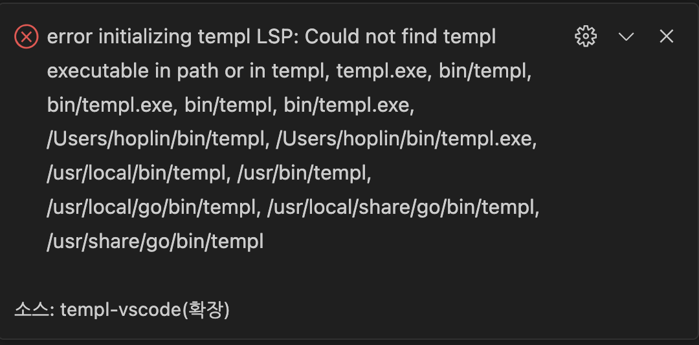
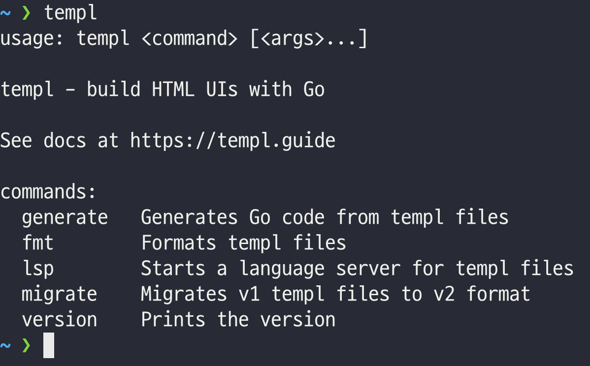

Circle CI Go Templ practice

---

Golang SSE(Server Side Rendering) with HTMX, Golang, Golang Templ, TailwindCSS(Daisy UI)

---

## Require

- Node.js v18 or upper

- Go 1.20 or upper

## Project Setting

### Visual Studio Code Setting

1. [templ-vscode](https://marketplace.visualstudio.com/items?itemName=a-h.templ)

2. [Tailwind CSS Intellisense](https://marketplace.visualstudio.com/items?itemName=bradlc.vscode-tailwindcss)

### Install Dependencies

1. Node.js Dependencies

   ```
   npm install

   // or

   yarn install
   ```

2. Golang Dependencies

   ```
   go mod download
   ```

### Golang Templ

[Document](https://templ.guide)

1. Install templ binary

   ```
   go install github.com/a-h/templ/cmd/templ@latest
   ```

## Trobule shooting

### Templ Extension



1. Check if your `go/bin` directory registered to shell path

   ```bash
   // ZSH
   // Append following to the last line of ~/.zshrc

   export PATH=$PATH:$HOME/go/bin
   ```

2. If temple binary are linked, command will be execute as under below

   

### Temple TailwindCSS Integrations

[Document](https://templ.guide/commands-and-tools/ide-support)

> By default VS Code will not trigger completions when editing "string" content, for example within JSX attribute values. Updating the editor.quickSuggestions setting may improve your experience

```
// VSCode settings.json

{
   ...

   "tailwindCSS.includeLanguages": {
    "templ": "html"
   },
   "editor.quickSuggestions": {
      "strings": "on"
   }

   ...
}
```
